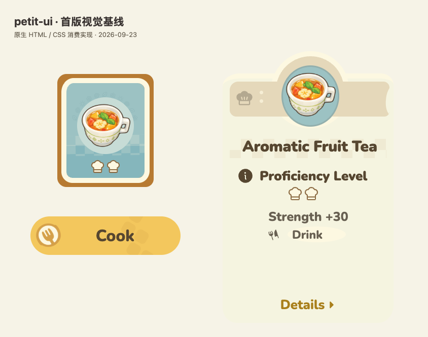

# S03 首版视觉基线与资源

用户已认可 2026-09-23 的当前版本作为首版视觉基线。后续站点从[三个控件配方](../../recipes/s03-controls.md)与这些资源继续，不需要历史临时目录。包保持 tokens-only，本目录不会进入 npm tarball。



截图只包含消费方实现，不包含官方界面截图。官方观察来源是 [Final Beta 公告](https://www.hoyolab.com/article/46776026)第 4 张烹饪图；图片 URL、观察尺寸及参考文件校验值见 [sources.json](sources.json)。官方公开截图不等于官方设计 token 或资产授权。

## 独立示例素材

- [tea.png](tea.png)：内置 image_gen 生成的独立茶杯插画，带透明度。保持等比缩放；详细程度与原图仍不同。
- [cook-emblem-mask.png](cook-emblem-mask.png)：同一工具生成的透明单色叉环徽记。三齿叉的柄接到外围圆环，负形透明；通过 CSS mask 与奶油圆面组合。只用于 Cook，不替换 Drink 的库图标。

两张图的实际生成提示词、尺寸、内容边界和 SHA-256 在 sources.json 中维护。它们不是从官方整控件截图裁出的实现，也不是官方源图标。这里保存独立生成的示例文件；项目软件许可见[根目录 LICENSE](../../../LICENSE)，第三方资源遵循下文各自的许可。

## 图标与许可

`chef-outline.svg` 来自 Lucide，配方内沿用其原始路径并用 CSS 指定奶油填充和褐色轮廓；许可见 [lucide-LICENSE](lucide-LICENSE)，包含 ISC 与部分 Feather 衍生内容的 MIT 声明。

其他 SVG 来自 Phosphor：`chef-hat.svg`、`fork-knife.svg`、`info.svg`、`caret-right.svg` 用于相应语义；`leaf.svg`、`spiral.svg`、`flower.svg`、`sun.svg` 用于装饰弧。许可见 [phosphor-LICENSE](phosphor-LICENSE)。原下载 URL 与文件校验值在 sources.json 中维护。

## 字体复现

原始视觉研究不纳入字体文件；当前文档站已在 `site/.vitepress/theme/assets/` 自托管 Nunito 及其 OFL 许可，中文正文使用系统字体。sources.json 的 `fonts` 提供 Nunito 和 Noto Sans SC 的下载 URL、许可与本轮实际文件校验值；对应源仓库的 OFL 文本应与下载字体一起保存。消费方将文件提供为 `/fonts/nunito.ttf` 与 `/fonts/notosanssc.ttf`，再加载：

```css
@font-face {
  font-family: Nunito;
  src: url('/fonts/nunito.ttf') format('truetype');
  font-weight: 200 1000;
  font-display: swap;
}
@font-face {
  font-family: 'Noto Sans SC';
  src: url('/fonts/notosanssc.ttf') format('truetype');
  font-weight: 100 900;
  font-display: swap;
}
```

英文标题使用 900，Cook 和 Details 使用 800；中文主操作使用 900。截图前等待 `document.fonts.ready` 并确认浏览器实际使用下载字形，不能只检查 CSS 字体声明。系统回退字体或未加载字体会改变比例与基线。

## 验收与后续边界

首版浏览器验收使用 Chrome 153.0.8010.53。包级颜色、主题、覆盖和映射检查与真实 tarball 消费见[开发指南](../../development.md)。既有 214 项浏览器检查覆盖 tokens 与三个控件，Cook 徽记替换另有 22 项定点检查；这些记录包含当时的主题范围及持久资源。计数记录对应当时快照，不替代以后变更的验证。

后续 site 可加载这些素材并按配方实现真实交互、响应式布局和长文案。固定研究尺寸不等于通用组件约束。颜色语义、对比度限制和主题契约以 [Token 规范](../../specs/tokens-v1.md)为准；不要把仅适合大号文字的 `foreground-accent` 用于小号正文或链接。OIDC、npm 发版、版本号与项目许可见[版本与发布](../../release.md)。
