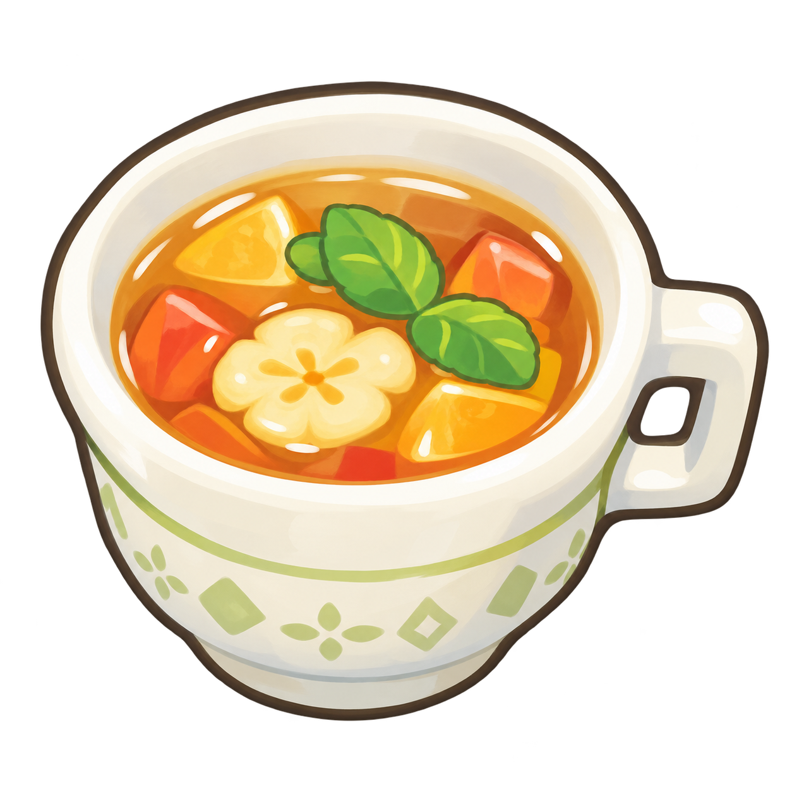

# S03 三个控件的消费配方

状态：用户已认可当前版本作为首版视觉基线（2026-09-23）。配方记录消费样式，不是组件 API，也不声称逐像素复刻。公共变量和主题以 [Token 规范](../specs/tokens-v1.md)为准。

三个控件以 16px 根字号、同尺度同文案比较：选择卡 190 × 223px，Cook 296 × 76px，详情面板 344 × 536px。字体、素材、图标、几何和交互由消费方提供；包只提供共享视觉参数。固定尺寸用于视觉研究，长文案、用户字号缩放和窄屏布局需消费方另行适配。

## 共同基础与素材

导入 `petit-ui/tokens.css`；样例实际加载 Nunito 可变字体，标题 900、主操作 800、辅助层级 800，禁用合成字重。Cook 曾同屏对照 800／850／900 后选择 800。中文单独加载 Noto Sans SC 900，不代表官方中文字体。字体来自 [Nunito](https://github.com/google/fonts/tree/main/ofl/nunito)和 [Noto Sans SC](https://github.com/google/fonts/tree/main/ofl/notosanssc)，遵守 OFL-1.1；字体加载结束且实际字形检查后再截图。

最终示例资源与来源记录保存在 [docs/assets/s03](../assets/s03/README.md)。下列 HTML 与 CSS 的相对路径假定文件位于 `docs/recipes/`；迁入 site 时同步调整路径。图标资源包括：

- 等级帽子采用 [Lucide chef-hat](https://github.com/lucide-icons/lucide/blob/main/icons/chef-hat.svg) 的原始路径，遵守 [Lucide 许可](https://github.com/lucide-icons/lucide/blob/main/LICENSE)。仅用 CSS 设置轮廓、填充和尺寸，未重绘路径。
- 餐具、信息、箭头与横带帽子来自 [Phosphor fill](https://github.com/phosphor-icons/core/tree/main/raw/fill)，文件分别保存为 `fork-knife.svg`、`info.svg`、`caret-right.svg`、`chef-hat.svg`。
- 弧形装饰来自 [Phosphor regular](https://github.com/phosphor-icons/core/tree/main/raw/regular) 的 `leaf`、`spiral`、`flower`、`sun`，保存同名 SVG；遵守 MIT 许可。它们是示例符号，不是官方纹样。
- `tea.png` 是独立生成的示例媒体，原图 1254 × 1254px，非透明内容边界约 `(0,85)–(1221,1206)`。保持等比缩放，不使用 `object-fit: fill`。图片仍比参考更细致、更有光泽，未重新生成整套画面。

字体、图片、图标和下面的消费样式均不进入发布包。CSS 中不再维护与公共 token 重复的临时色板。

```css
@import 'petit-ui/tokens.css';

* {
  box-sizing: border-box;
}
.sample {
  font-family: Nunito, sans-serif;
  font-synthesis: none;
}
h3,
p {
  margin: 0;
}
button {
  cursor: pointer;
}
button:disabled {
  cursor: not-allowed;
}
button:focus-visible {
  outline: 3px solid var(--petit-color-focus);
  outline-offset: 5px;
}
.icon {
  display: inline-block;
  flex: none;
  width: 26px;
  height: 26px;
  background: currentColor;
  mask-size: contain;
  mask-repeat: no-repeat;
  mask-position: center;
}
.fork {
  mask-image: url('../assets/s03/fork-knife.svg');
}
.info {
  mask-image: url('../assets/s03/info.svg');
}
.caret {
  mask-image: url('../assets/s03/caret-right.svg');
}
.rank-icon {
  display: block;
  flex: none;
  color: color-mix(
    in srgb,
    var(--petit-color-border-selected) 45%,
    var(--petit-color-foreground-muted)
  );
  fill: var(--petit-color-border);
  stroke-width: 1.65;
}
.rank-icon path:last-child {
  fill: none;
}
```

复用的等级图标（以下路径原样来自 Lucide）：

```html
<svg
  class="rank-icon"
  viewBox="0 0 24 24"
  stroke="currentColor"
  stroke-linecap="round"
  stroke-linejoin="round"
  aria-hidden="true"
>
  <path
    d="M17 21a1 1 0 0 0 1-1v-5.35c0-.457.316-.844.727-1.041a4 4 0 0 0-2.134-7.589 5 5 0 0 0-9.186 0 4 4 0 0 0-2.134 7.588c.411.198.727.585.727 1.041V20a1 1 0 0 0 1 1Z"
  />
  <path d="M6 17h12" />
</svg>
```

## 选择卡

原生按钮用 `aria-pressed` 表示选择，右上角勾号提供可见的非颜色标记。8px 赭色边完整包裹 10px 奶油框，取消选择保留占位。31px 图标容器的可见轮廓约 23px；与面板共享填充、轮廓颜色和线宽，按不同上下文单独定位。

装饰弧由 11 个 13px 符号组成，半径 61px，从 −76° 到 76°；使用青灰混色与 32% 透明度，避免规则褐色圆点圈。纹样只承担装饰，不表达状态。

```html
<button class="recipe-card" type="button" aria-label="Aromatic Fruit Tea" aria-pressed="true">
  <span class="card-shell"
    ><span class="card-surface"
      ><span class="card-arc" aria-hidden="true"
        ><i class="arc-symbol arc-leaf" style="--angle:-76.0deg"></i
        ><i class="arc-symbol arc-spiral" style="--angle:-60.8deg"></i
        ><i class="arc-symbol arc-sun" style="--angle:-45.6deg"></i
        ><i class="arc-symbol arc-flower" style="--angle:-30.400000000000006deg"></i
        ><i class="arc-symbol arc-spiral" style="--angle:-15.200000000000003deg"></i
        ><i class="arc-symbol arc-leaf" style="--angle:0.0deg"></i
        ><i class="arc-symbol arc-flower" style="--angle:15.199999999999989deg"></i
        ><i class="arc-symbol arc-sun" style="--angle:30.39999999999999deg"></i
        ><i class="arc-symbol arc-spiral" style="--angle:45.599999999999994deg"></i
        ><i class="arc-symbol arc-leaf" style="--angle:60.79999999999998deg"></i
        ><i class="arc-symbol arc-flower" style="--angle:76.0deg"></i></span
      ><span class="card-pattern" aria-hidden="true"></span
      ><span class="media-disc"></span
      ><span class="card-rank" aria-hidden="true"
        ><!-- 重用上方 rank-icon -->
        <!-- 重用上方 rank-icon -->
      </span></span
    ></span
  >
  <span class="selection-mark" aria-hidden="true">✓</span>
</button>
```

```css
.recipe-card {
  width: 190px;
  height: 223px;
  border: var(--petit-border-width-selected) solid transparent;
  padding: 0;
  border-radius: 18px 17px 16px 18px;
  background: transparent;
  position: relative;
  appearance: none;
}
.recipe-card[aria-pressed='true'] {
  background: var(--petit-color-border-selected);
  border-color: var(--petit-color-border-selected);
}
.selection-mark {
  position: absolute;
  z-index: 4;
  top: 8px;
  right: 8px;
  display: none;
  place-items: center;
  width: 28px;
  height: 28px;
  border: 2px solid var(--petit-color-border-strong);
  border-radius: var(--petit-radius-full);
  background: var(--petit-color-primary);
  color: var(--petit-color-on-primary);
  font-size: 20px;
  font-weight: var(--petit-font-weight-strong);
  line-height: 1;
}
.recipe-card[aria-pressed='true'] .selection-mark {
  display: grid;
}
.card-shell {
  display: block;
  width: 100%;
  height: 100%;
  border: var(--petit-border-width-frame) solid var(--petit-color-border);
  border-radius: 24px 24px 22px 22px / 28px 22px 24px 22px;
  overflow: hidden;
}
.card-surface {
  display: block;
  position: relative;
  width: 100%;
  height: 100%;
  background: var(--petit-color-surface-accent);
  overflow: hidden;
  border-radius: 12px 13px 14px 12px;
}
.card-surface:after {
  content: '';
  position: absolute;
  inset: 124px 0 0;
  background: var(--petit-color-surface-accent-strong);
}
.card-pattern {
  position: absolute;
  z-index: 1;
  inset: 103px 0 auto;
  height: 40px;
  background: conic-gradient(
    from 90deg,
    transparent 25%,
    color-mix(in srgb, var(--petit-color-border) 18%, transparent) 0 50%,
    transparent 0 75%,
    color-mix(in srgb, var(--petit-color-border) 18%, transparent) 0
  );
  background-size: 36px 36px;
  transform: rotate(-1deg);
}
.media-disc {
  position: absolute;
  z-index: 2;
  left: 50%;
  top: 28px;
  transform: translateX(-50%);
  width: 112px;
  height: 112px;
  background: var(--petit-color-surface-accent-soft);
  border-radius: 50%;
}
.tea {
  display: block;
  width: 100%;
  height: 100%;
  object-fit: contain;
}
.media-disc .tea {
  width: 104px;
  height: 104px;
  position: absolute;
  left: 4px;
  top: 3px;
  object-fit: contain;
}
.card-rank {
  position: absolute;
  z-index: 3;
  bottom: 7px;
  left: 0;
  right: 0;
  display: flex;
  justify-content: center;
  gap: 0;
  color: var(--petit-color-border);
  filter: none;
}
.card-rank .rank-icon {
  width: 31px;
  height: 31px;
}
.card-arc {
  position: absolute;
  z-index: 1;
  inset: 0;
  color: color-mix(
    in srgb,
    var(--petit-color-surface-accent-strong) 85%,
    var(--petit-color-foreground)
  );
  opacity: 0.32;
  pointer-events: none;
}
.arc-symbol {
  position: absolute;
  left: 69px;
  top: 77px;
  width: 13px;
  height: 13px;
  background: currentColor;
  mask-size: contain;
  mask-position: center;
  mask-repeat: no-repeat;
  transform: rotate(var(--angle)) translateY(-61px);
}
.arc-spiral {
  mask-image: url('../assets/s03/spiral.svg');
}
.arc-flower {
  mask-image: url('../assets/s03/flower.svg');
}
.arc-leaf {
  mask-image: url('../assets/s03/leaf.svg');
}
.arc-sun {
  mask-image: url('../assets/s03/sun.svg');
}
```

媒体盒为 92px 正方形，定位考虑透明内容边界；媒体圆底仍为 112px。棋盘带和上下青灰分区保持原有结构。

## Cook 主操作

左侧徽记采用独立的 `../assets/s03/cook-emblem-mask.png`，不复用 `.fork`。已放大检查 S03：官方是粗圆三齿叉，叉柄接到外侧圆环右下方，奶油色形成负形，没有刀。素材由内置 image_gen 依据此局部生成，非官方源资产；没有将整块按钮截图贴入实现。来源与完整提示词保存在 [sources.json](../assets/s03/sources.json)。

PNG 为 1254 × 1254px，实际透明内容边界 `(34,49)–(1221,1181)`。以 51px 方盒放在左侧 10px、顶部 12px，实际可见徽记约 48 × 46px。图形本身已包含倾斜角度，不再旋转整个圆盘。CSS mask 负责金色叉环；底下的奶油圆面填入负形，移除旧图标的额外外阴影。金色由已有 primary 与 border-selected 混合，不增加公共 token 或依赖。

按钮仍为 296 × 76px，文字使用上一轮确认的 32px／800、顶部 22px，保留稀疏右侧纹样。截图与配方清理时曾遗漏字重覆盖，本轮恢复到该已确认值。Drink 的 `.fork` 和原资源保持不变。

```html
<button class="cook">
  <span class="cook-icon" aria-hidden="true"><i class="cook-emblem"></i></span
  ><span class="cook-label">Cook</span><span class="cook-pattern" aria-hidden="true"></span>
</button>
```

```css
.cook {
  width: 296px;
  height: 76px;
  border: 0;
  padding: 0;
  position: relative;
  overflow: hidden;
  border-radius: var(--petit-radius-full);
  background: var(--petit-color-primary);
  color: var(--petit-color-on-primary);
  font:
    var(--petit-font-weight-strong) var(--petit-font-size-action)/1 Nunito,
    sans-serif;
  isolation: isolate;
}

.cook:enabled:hover {
  background: var(--petit-color-primary-hover);
}

.cook.hover-preview {
  background: var(--petit-color-primary-hover);
}

.cook:enabled:active {
  background: var(--petit-color-primary-active);
}

.cook-label {
  position: absolute;
  left: 92px;
  right: 54px;
  top: 22px;
  white-space: nowrap;
  z-index: 2;
}

.cook-icon {
  position: absolute;
  left: 10px;
  top: 12px;
  width: 51px;
  height: 51px;
  color: color-mix(in srgb, var(--petit-color-primary) 50%, var(--petit-color-border-selected));
}

.cook-pattern {
  position: absolute;
  width: 106px;
  height: 90px;
  right: 42px;
  top: -13px;
  opacity: 0.11;
  transform: rotate(31deg);
  background: none;
  border-radius: 40px;
}

.cook:disabled {
  background: var(--petit-color-surface-hover);
  color: var(--petit-color-foreground-disabled);
}

.cook:disabled .cook-icon {
  opacity: 0.4;
}

.chinese .cook-label {
  font-family: 'Noto Sans SC', sans-serif;
  font-weight: var(--petit-font-weight-display);
  font-size: 27px;
  left: 76px;
  right: 25px;
}

.cook-pattern:before {
  content: '';
  position: absolute;
  left: 0;
  top: 0;
  width: 25px;
  height: 25px;
  border-radius: 8px;
  background: var(--petit-color-border-selected);
  box-shadow:
    30px 0 0 var(--petit-color-border-selected),
    30px 30px 0 var(--petit-color-border-selected),
    60px 30px 0 var(--petit-color-border-selected),
    60px 60px 0 var(--petit-color-border-selected),
    90px 60px 0 var(--petit-color-border-selected);
}

.cook-icon::before {
  content: '';
  position: absolute;
  inset: 4px;
  border-radius: var(--petit-radius-full);
  background: var(--petit-color-border);
}

.cook-emblem {
  position: absolute;
  inset: 0;
  display: block;
  background: currentColor;
  mask: url('../assets/s03/cook-emblem-mask.png') center / contain no-repeat;
}
```

中文标签继续使用已加载的 Noto Sans SC，27px／900。禁用降低整个徽记的透明度，焦点仍使用按钮外围独立轮廓。新图形轮廓关系已修正；生成圆环的右上／左下手绘起伏与官方仍有轻微差异。

## 纸色详情面板

顶部凸起、纸面和横带互相覆盖形成连贯轮廓。横带右侧用椭圆形纸色覆盖产生柔和缺口，替代锐利多边形。媒体保持等比；名称、熟练度、等级、效果、类型、Details 的原有顺序和大段留白保持不变。

```html
<article class="detail-panel" aria-labelledby="tea-title">
  <div class="panel-body"></div>
  <div class="panel-crown"></div>
  <div class="panel-band" aria-hidden="true"><span class="band-notch"></span></div>
  <div class="panel-medallion">
    
  </div>
  <div class="panel-title-pattern" aria-hidden="true"></div>
  <h3 class="detail-title" id="tea-title">Aromatic Fruit Tea</h3>
  <div class="proficiency">
    <i class="icon info" aria-hidden="true"></i><span>Proficiency Level</span>
  </div>
  <div class="panel-rank" aria-label="Proficiency level two">
    <!-- 重用上方 rank-icon -->
    <!-- 重用上方 rank-icon -->
  </div>
  <p class="strength">Strength +30</p>
  <p class="category"><i class="icon fork" aria-hidden="true"></i><span>Drink</span></p>
  <button class="details" aria-expanded="false">
    Details<i class="icon caret" aria-hidden="true"></i>
  </button>
</article>
```

```css
.panel-compare .stage {
  height: 566px;
}
.detail-panel {
  width: 344px;
  height: 536px;
  position: relative;
  flex: none;
  color: var(--petit-color-foreground-heading);
  isolation: isolate;
}
.panel-body {
  position: absolute;
  left: 3px;
  right: 4px;
  top: 44px;
  bottom: 0;
  background: var(--petit-color-surface);
  border: var(--petit-border-width-frame) solid var(--petit-color-border);
  border-bottom: 0;
  border-radius: 34px 25px 30px 28px / 25px 22px 35px 30px;
  z-index: -2;
  border-left: 0;
  border-right: 0;
}
.panel-crown {
  position: absolute;
  width: 154px;
  height: 152px;
  left: 98px;
  top: 0;
  border: calc(var(--petit-border-width-frame) + 1px) solid var(--petit-color-border);
  background: var(--petit-color-surface-band);
  border-radius: 51% 49% 48% 49%;
  z-index: -1;
  border-width: var(--petit-border-width-frame);
}
.panel-band {
  position: absolute;
  left: 17px;
  right: 12px;
  top: 60px;
  height: 69px;
  background: var(--petit-color-surface-band);
  clip-path: none;
  border-radius: 17px 12px 10px 13px;
  z-index: -1;
  overflow: hidden;
}
.panel-medallion {
  position: absolute;
  top: 28px;
  left: 119px;
  width: 114px;
  height: 121px;
  background: var(--petit-color-surface-accent);
  border-radius: 50%;
  border: 3px solid
    color-mix(in srgb, var(--petit-color-foreground-heading) 15%, var(--petit-color-surface-accent));
}
.panel-medallion .tea {
  position: absolute;
  width: 106px;
  height: 106px;
  left: 1px;
  top: 1px;
  object-fit: contain;
}
.detail-title {
  position: absolute;
  left: 42px;
  right: 20px;
  top: 171px;
  font:
    var(--petit-font-weight-display) var(--petit-font-size-heading)/1.15 Nunito,
    sans-serif;
  white-space: nowrap;
  letter-spacing: -0.3px;
  font-weight: var(--petit-font-weight-display);
  font-size: var(--petit-font-size-heading);
}
.panel-title-pattern {
  position: absolute;
  top: 173px;
  left: 17px;
  right: 18px;
  height: 38px;
  background: conic-gradient(
    from 90deg,
    transparent 25%,
    var(--petit-color-surface-band) 0 50%,
    transparent 0 75%,
    var(--petit-color-surface-band) 0
  );
  background-size: 44px 44px;
  opacity: 0.35;
}
.proficiency {
  position: absolute;
  top: 229px;
  left: 31px;
  display: flex;
  align-items: center;
  gap: 11px;
  font-size: var(--petit-font-size-label);
  line-height: 1;
  font-weight: var(--petit-font-weight-display);
  white-space: nowrap;
}
.proficiency .icon {
  width: 34px;
  height: 34px;
  color: var(--petit-color-foreground-heading);
}
.panel-rank {
  position: absolute;
  top: 265px;
  left: 130px;
  display: flex;
  color: var(--petit-color-border-strong);
  gap: 0;
}
.strength {
  position: absolute;
  top: 309px;
  left: 0;
  right: 0;
  text-align: center;
  font-size: 25px;
  line-height: 1.4;
  font-weight: var(--petit-font-weight-strong);
  color: var(--petit-color-foreground-muted);
}
.category {
  position: absolute;
  top: 351px;
  left: 92px;
  display: flex;
  align-items: center;
  gap: 25px;
  font-size: 23px;
  font-weight: var(--petit-font-weight-strong);
  color: var(--petit-color-foreground-muted);
  line-height: 1;
}
.category:before {
  content: '';
  position: absolute;
  z-index: -1;
  left: 39px;
  top: -5px;
  width: 115px;
  height: 31px;
  background: var(--petit-color-border);
  border-radius: 50%;
}
.category .icon {
  width: 23px;
  height: 23px;
  color: var(--petit-color-foreground-muted);
  transform: rotate(-18deg);
}
.details {
  position: absolute;
  left: 0;
  right: 0;
  bottom: 19px;
  margin: auto;
  display: flex;
  align-items: center;
  justify-content: center;
  width: 125px;
  height: 33px;
  font:
    var(--petit-font-weight-strong) var(--petit-font-size-label)/1 Nunito,
    sans-serif;
  color: var(--petit-color-foreground-accent);
  border: 0;
  background: transparent;
  font-weight: var(--petit-font-weight-strong);
}
.details .icon {
  width: 20px;
  height: 20px;
  margin-left: 3px;
}
.panel-band:before {
  content: '';
  position: absolute;
  width: 36px;
  height: 40px;
  left: 11px;
  top: 13px;
  mask: url('../assets/s03/chef-hat.svg') center/contain no-repeat;
  background: var(--petit-color-foreground-muted);
  opacity: 0.4;
}
.panel-band:after {
  content: '';
  position: absolute;
  left: 59px;
  top: 18px;
  width: 7px;
  height: 7px;
  border-radius: 50%;
  background: var(--petit-color-border);
  box-shadow: 0 17px 0 var(--petit-color-border);
  opacity: 0.7;
}
.panel-rank .rank-icon {
  width: 32px;
  height: 32px;
}
.band-notch {
  position: absolute;
  width: 29px;
  height: 60px;
  right: -22px;
  top: 7px;
  border-radius: 48%;
  background: var(--petit-color-surface);
  transform: rotate(5deg);
}
```

辅助字维持 `foreground-muted`；Details 使用新增的 `foreground-accent`，实际为 Nunito 26px／800。它在浅色纸面上的对比度约 3.293:1（验证时不舍入），仅限大号强调文字；小号链接仍用 `link` 并保持 4.5:1。该角色也可用于其他大号强调标签／标题，不是 Details 专用颜色。只能用在 `background` 或 `surface` 上，且实际达到至少 24px，或至少 18.67px 且粗体。依据 [WCAG 2.2 大文本对比度](https://www.w3.org/WAI/WCAG22/Understanding/contrast-minimum.html)。

## Tailwind、交互与边界

Tailwind 4 导入 `tailwindcss` 和 `petit-ui/tailwind.css` 后，使用同名颜色角色，如 `text-petit-foreground-accent`、`bg-petit-surface-band`；厚框为 `border-petit-frame`／`border-petit-selected`，字重为 `font-petit-display`／`font-petit-strong`，字号为 `text-petit-heading`／`text-petit-label`／`text-petit-action`。共 40 项映射仍需组合消费方结构和几何，不会自动生成控件。

选择卡点击更新 `aria-pressed`，原生按钮支持 Enter／空格；Cook 通过文字状态反馈结果；Details 展开时同步 `aria-expanded`，禁用使用原生 `disabled`。选中状态和高对比焦点相互独立。

首版实现截图见[视觉基线](../assets/s03/baseline-light.png)，它保留勾号补充前的造型记录；当前配方与站点增加可见选择标记。样式已整理为当前有效定义。已知差异仍包括示例媒体细节、替代图标／装饰、字形与手绘曲线；用户已认可这一版作为首版基线；后续扩展以此为起点。
